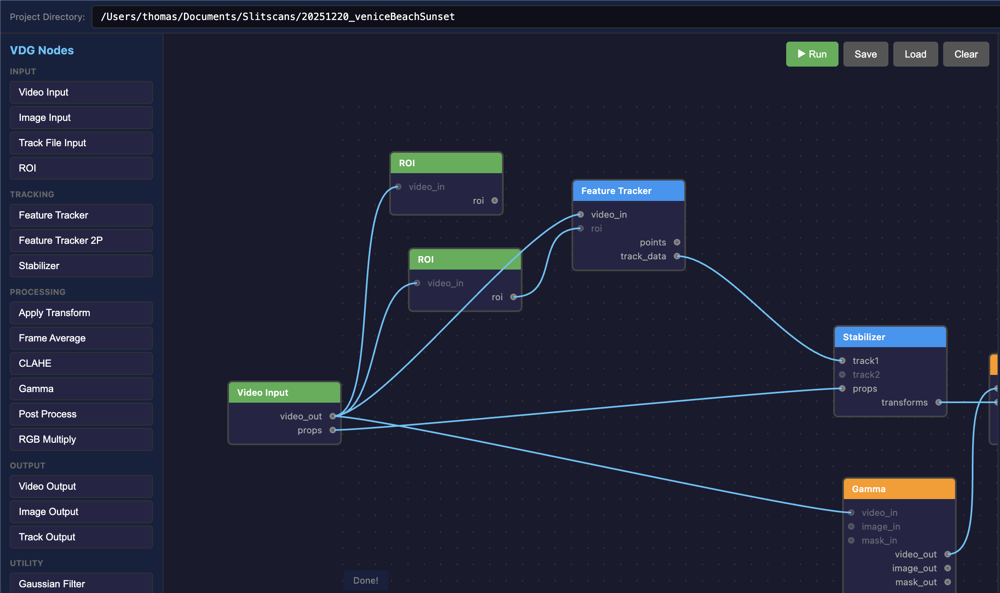

# VDG - Video Development and Grading Toolkit

A modular Python framework for video point tracking, stabilization, frame averaging, and post-processing with a web-based visual node editor.



## Features

- **Web Node Editor**: Visual graph-based workflow editor with real-time execution
- **Streaming Pipeline**: Memory-efficient frame-by-frame processing (O(1) memory)
- **Point Tracking**: Lucas-Kanade optical flow tracking with automatic feature replenishment
- **Two-Point Tracking**: Single-pass tracking of two points for rotation/scale stabilization
- **Blender Integration**: Import tracking data from Blender's movie clip editor (.crv files)
- **Stabilization**: Transform-based video stabilization (translation, rotation, scale, perspective)
- **Frame Averaging**: Temporal frame stacking with alpha compositing
- **Post-Processing**: Alpha compositing operations with modular operation registry
- **Linear Compositing**: Gamma-correct compositing in linear color space
- **Hardware Acceleration**: VideoToolbox (macOS), NVENC (NVIDIA), VAAPI (Linux)

## Quick Start

### Web Node Editor

The easiest way to use VDG is through the web-based node editor:

```bash
# Start the node editor
python -m vdg.nodes.web_editor

# Open in browser
# http://localhost:8000
```

### Example Workflows

Load pre-built workflows from the `workflows/` directory:

- `feature_track.json` - Single point tracking
- `feature_track_2p.json` - Two-point tracking in single pass
- `stabilize_linear_composite.json` - Linear color space compositing with stabilization
- `post_process.json` - Post-processing from existing images

## Node Editor

### Available Nodes

#### Input Nodes
| Node | Description | Outputs |
|------|-------------|---------|
| **Video Input** | Load video file | `video_out`, `props` |
| **Image Input** | Load existing image (PNG, TIFF, EXR) | `image_out` |
| **Track Input** | Load .crv track file | `track_data` |
| **ROI** | Define region of interest | `roi` |

#### Tracking Nodes
| Node | Description | Inputs | Outputs |
|------|-------------|--------|---------|
| **Feature Tracker** | Track single point in video | `video_in`, `roi` | `points`, `track_data` |
| **Feature Tracker 2P** | Track two points in single pass | `video_in`, `roi1`, `roi2` | `track1`, `track2` |
| **Stabilizer** | Compute transforms from tracks | `track1`, `track2`, `props` | `transforms` |

#### Processing Nodes
| Node | Description | Inputs | Outputs |
|------|-------------|--------|---------|
| **Apply Transform** | Apply stabilization | `video_in`, `transforms` | `video_out`, `mask_out` |
| **Frame Average** | Accumulate frames | `video_in`, `mask_in` | `image_out`, `alpha_out` |
| **Gamma** | Linear/sRGB conversion | `video_in`/`image_in`, `mask_in` | `video_out`/`image_out`, `mask_out` |
| **CLAHE** | Adaptive contrast | `image_in` | `image_out` |
| **Post Process** | Alpha compositing operations | `image_in`, `alpha_in` | `image_out` |

#### Output Nodes
| Node | Description | Inputs |
|------|-------------|--------|
| **Image Output** | Save image (PNG/TIFF) | `image_in` |
| **Video Output** | Save video | `video_in`, `props` |
| **Track Output** | Save .crv track file | `track_data`, `props` |

### Node Parameters

#### Feature Tracker 2P
- `min_distance`: Minimum distance between tracked points (default: 7)
- `quality_level`: Corner detection quality threshold (default: 0.3)
- `block_size`: Corner detection block size (default: 7)
- `win_size`: Optical flow window size (default: 15)
- `max_level`: Pyramid levels for optical flow (default: 2)
- `back_threshold`: Forward-backward validation threshold (default: 1.0)

#### Stabilizer
- `mode`: `single` (translation), `two_point` (translation+rotation+scale), `vstab`, `perspective`
- `ref_frame`: Reference frame (-1 = first frame with track data)
- `swap_xy`: Swap X/Y coordinates
- `x_flip`: Flip X coordinate
- `y_flip`: Flip Y coordinate

#### Apply Transform
- `x_pad`, `y_pad`: Canvas padding (pixels)
- `x_offset`, `y_offset`: Position offset (pixels)

#### Frame Average
- `comp_mode`: `on_black`, `on_white`, `unpremult`
- `brightness`: Output brightness multiplier

#### Gamma
- `mode`: `to_linear` (sRGB→linear) or `to_srgb` (linear→sRGB)
- `gamma`: Gamma value (default 2.2)

#### Post Process
- `operation`: Select compositing operation (see below)
- `trim`: Crop output to non-black alpha bounding box
- `gamma`: Inverse gamma for alpha (refine_alpha only, default 2.2)
- `contrast`: Sigmoid contrast strength (refine_alpha only, default 60.0)
- `threshold`: Sigmoid threshold (refine_alpha only, default 0.0015)
- `blur_size`: Gaussian blur size (refine_alpha only, default 5.0)
- `power`: Power curve exponent (refine_alpha only, default 8.0)

### Post-Process Operations

The post-process node provides alpha compositing operations:

| Operation | Description |
|-----------|-------------|
| `comp_on_white` | Composite premultiplied RGB over white background |
| `comp_on_black` | Composite over black (clamp values) |
| `refine_alpha` | Apply gamma, sigmoid contrast, blur, and power curve to alpha, then composite on white |
| `divide_alpha` | Unpremultiply (divide RGB by alpha), result on black |
| `unpremult_on_white` | Unpremultiply then add inverse alpha for white background |

#### Adding Custom Operations

Operations are defined in `vdg/postprocess/operations.py` using a decorator pattern:

```python
from vdg.postprocess.operations import register_operation

@register_operation("my_operation", "Description of what it does")
def my_operation(image: np.ndarray, alpha: np.ndarray, **params) -> np.ndarray:
    """
    Process image and alpha, return RGB result.

    Args:
        image: RGB image (uint8 or uint16, HxWx3)
        alpha: Alpha/mask (uint8 or uint16, HxW or HxWx1)
        **params: Additional parameters from node

    Returns:
        RGB image (same dtype as input)
    """
    # Your processing logic here
    return result
```

### Streaming Pipeline

The node editor uses a memory-efficient streaming architecture:

```
Streaming Chain (O(1) memory):
video_input → gamma → apply_transform → frame_average → image_output
     ↓
  1 frame at a time, never stores all frames in RAM
```

**Streamable nodes**: `video_input`, `feature_tracker`, `feature_tracker_2p`, `apply_transform`, `frame_average`, `gamma`, `clahe`, `video_output`, `image_output`

**Non-streamable nodes** (need all data first): `stabilizer`, `gaussian_filter`

### Linear Compositing Workflow

For physically accurate compositing, work in linear color space:

```
video_input → gamma(to_linear) → apply_transform → frame_average → gamma(to_srgb) → image_output
```

The gamma node:
- Converts sRGB video to linear light before compositing
- Converts back to sRGB for display/output
- Passes mask unchanged (already linear)

## Installation

```bash
# Clone the repository
git clone https://github.com/thomashollier/vdg.git
cd vdg

# Install in development mode
pip install -e .

# Or install dependencies directly
pip install -r requirements.txt
```

## Package Structure

```
vdg/
├── vdg/
│   ├── core/                     # Core abstractions
│   │   ├── base.py               # Base classes and protocols
│   │   ├── video.py              # Video I/O utilities
│   │   ├── hardware.py           # Hardware acceleration config
│   │   └── config.py             # Configuration management
│   │
│   ├── tracking/                 # Point tracking module
│   │   ├── tracker.py            # FeatureTracker class
│   │   ├── stabilizer.py         # Stabilization transforms
│   │   └── track_io.py           # .crv file I/O
│   │
│   ├── processing/               # Video/image processing
│   │   ├── frame_average.py      # Frame averaging/stacking
│   │   └── color.py              # Color correction utilities
│   │
│   ├── postprocess/              # Alpha compositing operations
│   │   ├── __init__.py           # Module exports
│   │   └── operations.py         # Operation registry and implementations
│   │
│   ├── nodes/                    # Web node editor
│   │   └── web_editor.py         # FastAPI server + graph executor
│   │
│   └── outputs/                  # Output handlers
│       ├── base.py               # BaseOutput abstract class
│       └── manager.py            # OutputManager
│
├── workflows/                    # Example workflow files
│   ├── feature_track.json
│   ├── feature_track_2p.json
│   ├── post_process.json
│   └── stabilize_linear_composite.json
│
├── scripts/                      # Original scripts (reference)
│   └── postProcessMovies.py
│
├── examples/                     # Example scripts
│   └── track_and_stabilize.py
│
└── tests/                        # Unit tests
```

## Command Line Usage

```bash
# Start node editor
python -m vdg.nodes.web_editor

# Track points in a video
vdg track input.mp4 -out previewtrack -out trackers=type=2

# Stabilize using tracking data
vdg stabilize input.mp4 -td track01.crv:track02.crv -wo

# Average frames
vdg frameavg input.mp4 -fs 100 -fe 500 -wa

# Run batch processing
vdg process -c process_config.json
```

## Python API

### Feature Tracking

```python
from vdg.tracking import FeatureTracker

# Create a tracker
tracker = FeatureTracker(num_features=50)

# Initialize on first frame
points = tracker.initialize(first_frame)

# Track through video
for frame in video_frames:
    points, ids, stats = tracker.update(frame)
```

### Frame Averaging

```python
from vdg.processing import FrameAverager, CompMode

averager = FrameAverager(comp_mode=CompMode.ON_BLACK)

for frame in video_frames:
    averager.add_frame(frame)

result = averager.finalize()
```

### Post-Processing

```python
from vdg.postprocess import apply_operation, get_operations
import cv2

# Load image and alpha
image = cv2.imread("image.png")
alpha = cv2.imread("alpha.png", cv2.IMREAD_GRAYSCALE)

# List available operations
print(get_operations())  # ['comp_on_white', 'comp_on_black', ...]

# Apply an operation
result = apply_operation("comp_on_white", image, alpha)

# Apply refine_alpha with custom parameters
result = apply_operation("refine_alpha", image, alpha,
                         gamma=2.2, contrast=60.0, power=8.0)
```

### Track File I/O

```python
from vdg.tracking.track_io import read_crv_file, write_crv_file

# Read track data
track_data = read_crv_file("track01.crv")
# Returns: {frame_num: (x, y), ...} with normalized coordinates

# Write track data
write_crv_file("output.crv", track_data)
```

## .crv Track File Format

The .crv format stores normalized (0-1) tracking coordinates:

```
1550 [[ 0.4521, 0.3892 ]]
1551 [[ 0.4523, 0.3895 ]]
1552 [[ 0.4519, 0.3891 ]]
```

Compatible with Blender's movie clip editor export.

## Configuration

### Pipeline Configuration (JSON)

```json
{
  "global_settings": {
    "prefix": "project_name",
    "keep_temp_files": false
  },
  "movies": {
    "clip_001": {
      "passes": [
        {
          "name": "stab",
          "type": "track",
          "track_files": ["track01.crv", "track02.crv"],
          "stab_options": "-wo -wm",
          "do_stab": true,
          "do_frameavg": true
        }
      ]
    }
  }
}
```

## Dependencies

- Python 3.10+
- OpenCV (cv2)
- NumPy
- SciPy (for Gaussian filtering)
- FastAPI + Uvicorn (for node editor)
- OpenImageIO (optional, for post-processing)

## Hardware Acceleration

VDG supports hardware-accelerated video encoding/decoding:

```python
from vdg.core.hardware import HardwareConfig

# Auto-detect available backends
config = HardwareConfig.auto_detect()
print(f"Using: {config.backend}")  # e.g., "videotoolbox"
```

Supported backends:
- **VideoToolbox** (macOS)
- **NVENC/NVDEC** (NVIDIA GPUs)
- **VAAPI** (Linux)

## License

MIT License

## Contributing

1. Fork the repository
2. Create a feature branch
3. Add tests for new functionality
4. Submit a pull request
